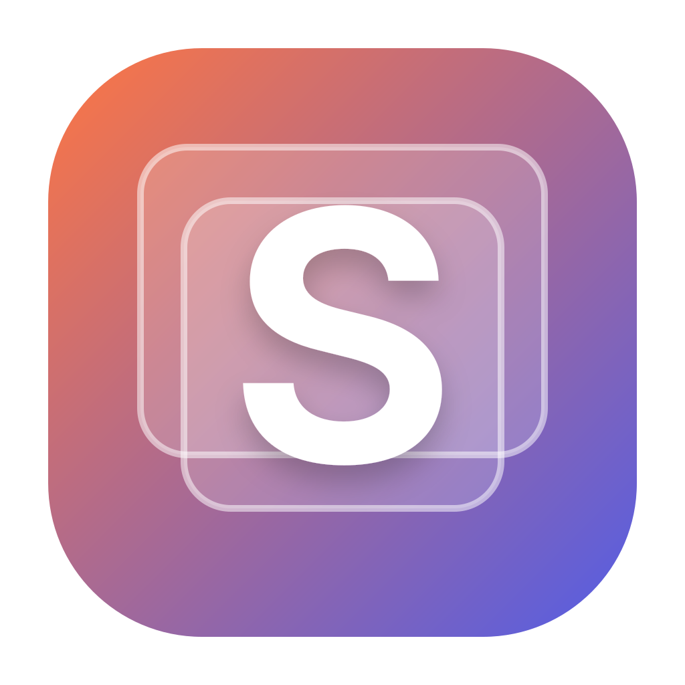

<div align="center">
  
  <h1>SwiftUI Demo</h1>
  <p>使用 SwiftUI 构建的 macOS 原生功能展示应用。</p>

  [](https://github.com/weepwood/SwiftUIDemo/actions/workflows/ci.yml)
  [](https://github.com/weepwood/SwiftUIDemo/actions/workflows/release.yml)
  [](https://www.apple.com/macos/)
  [](https://www.swift.org/)
</div>

## 项目定位

SwiftUI Demo 是一个可直接运行和复用的 macOS 示例项目，集中展示现代原生应用常用能力。项目使用 Swift Package 管理，无第三方运行时依赖，可直接通过 Xcode 打开 `Package.swift`。

## 已实现功能

- `NavigationSplitView` 侧边栏、统一工具栏与原生 Inspector。
- Dashboard、原生控件画廊、数据工作台、系统能力与关于页面。
- Button、TextField、TextEditor、Toggle、Picker、DatePicker、ColorPicker、Slider、Stepper、Gauge、Alert、Sheet、Popover、Menu 和 Context Menu。
- Swift Charts 柱状图、折线图和面积图。
- 原生 Table、搜索、选择、批量删除和上下文操作。
- 文件导入/导出、剪贴板、本地通知、异步任务与系统信息。
- Settings Scene、MenuBarExtra、多窗口和菜单命令快捷键。
- 浅色/深色主题、强调色与菜单栏显示设置。

## 本地运行

### Xcode

1. 使用 Xcode 15.3 或更高版本打开 `Package.swift`。
2. 选择 `SwiftUIDemo` Scheme。
3. 运行目标选择 `My Mac`，按 `⌘R` 启动。

### 命令行

```bash
swift run SwiftUIDemo
```

最低运行环境为 macOS 14。

## 自动构建与发布

仓库包含两条 GitHub Actions 工作流：

- `CI`：在 Apple Silicon 与 Intel macOS Runner 上执行构建和测试。
- `Release macOS`：分别编译 arm64 与 x86_64，使用 `lipo` 合成 Universal 应用，并生成 `.zip`、`.dmg` 与 `SHA256SUMS.txt`。

发布规则：

- 合并或推送到 `main`：自动更新 `nightly` 预发布版本。
- 推送 `v*` 标签：自动创建正式 GitHub Release，例如：

```bash
git tag v1.0.0
git push origin v1.0.0
```

- 也可以从 Actions 页面手动运行 `Release macOS` 并填写版本号。

## 签名与公证

未配置开发者证书时，工作流会生成 ad-hoc 签名的应用，可用于源码验证和本地测试。要生成 Developer ID 签名并通过 Apple 公证的版本，请配置以下 Repository Secrets：

| Secret | 说明 |
| --- | --- |
| `MACOS_CERTIFICATE` | Base64 编码的 Developer ID Application `.p12` |
| `MACOS_CERTIFICATE_PASSWORD` | `.p12` 密码 |
| `DEVELOPER_ID_APPLICATION` | 完整签名身份，例如 `Developer ID Application: ...` |
| `KEYCHAIN_PASSWORD` | CI 临时钥匙串密码，可选 |
| `APPLE_ID` | Apple ID |
| `APPLE_APP_SPECIFIC_PASSWORD` | App 专用密码 |
| `APPLE_TEAM_ID` | Apple Developer Team ID |

当签名与 Apple 凭据均存在时，工作流会自动执行 `notarytool` 公证和 `stapler` 装订。

## 项目结构

```text
SwiftUIDemo/
├── Sources/SwiftUIDemo/       # SwiftUI 应用源码
├── Tests/SwiftUIDemoTests/    # 单元测试
├── Packaging/                 # Info.plist 与应用图标
├── scripts/package-app.sh     # Universal App、ZIP、DMG 打包脚本
├── .github/workflows/         # CI 与自动发布
└── Package.swift
```

## 开源协议

MIT License
